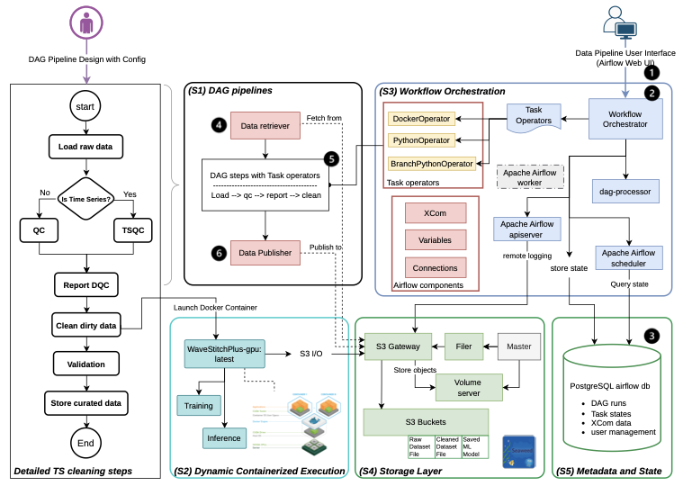

# Minimal DataOps Solution for 6G-DALI Data Cleaning

This repo is organized around a small, production-friendly DataOps path:

- Reusable data process modules in `src/data_process_modules/`
- Backward-compatible Python cleaning functions in `src/dataops/`
- `pytest` unit tests in `tests/`
- Pandera validation in `src/dataops/validation/` and Great Expectations checks in `src/dataops/ts_checks.py` / `src/dataops/tabular_checks.py`
- GitHub Actions CI in `.github/workflows/ci.yml`
- DVC data/version pipeline in `dvc.yaml`
- Airflow scheduling in `dags/minimal_dataops_dag.py`
- Structured logs plus optional failure notification through `DATAOPS_WEBHOOK_URL`

## Quick Start

```bash
python -m venv .venv
source .venv/bin/activate
python -m pip install --upgrade pip
python -m pip install -e ".[dev]"
python -m pytest
```

Run the minimal local pipeline:

```bash
python -m pipelines.minimal_dataops \
  --config config/dataops.yaml
```

`config/dataops.yaml` controls input/output paths, validation mode, optional
timestamp column, expected columns, numeric bounds, missingness threshold,
timestamp uniqueness, and timestamp ordering. With `validation.mode: auto`, the
pipeline classifies each dataset as `time_series` or `tabular`, records the
classification reason in the report, validates as time-series when a real
timestamp column is configured or detected, and otherwise validates as arbitrary
tabular data. Monotonic numeric ids are treated as tabular by default; set
`allow_step_index_timestamp: true` only when a step index really is your time
axis. CLI flags such as `--input`, `--output`, `--report`, and
`--timestamp-col` can still override the config for one-off runs.

The pipeline runs a five-stage lineage and writes an artifact for each stage:

```
raw → cleaned → remediated → regularized (gaps explicit) → final (imputed, gap-free)
```

- **cleaned** (`<output_stem>_cleaned.csv`, key `report.cleaned_output`) — conservative
  cleaning (snake_case columns, drop empty/duplicate rows, epoch-aware datetime coercion).
- **remediated** (the configured `output`) — per-issue fixes from `data_process_modules.remediation`
  (winsorize numeric outliers, type-aware tabular fill); time-series gaps are *deferred* to imputation.
- **regularized** — when a time-series gap is detected, the timeline is regularized onto a
  uniform grid (gaps become explicit NaN rows) and written as a prepared bundle.
- **final** — the gap-filled, analysis-ready dataset (built by the imputation step, see below).

The report's `quality` section comes from Great Expectations-backed checks and carries an
`action_plan` tagging each issue with its `status` (`applied_by_remediation`,
`deferred_to_imputation`, or `manual`) plus the concrete failed GX expectations. `quality_after`
re-runs the checks on the remediated frame so the report holds a genuine GX **before/after**.
`handoff` advertises the imputation method catalog and the config-selected `(app, method)`;
`validation_comparison` is chart-ready data (raw → cleaned → remediated, GX/Pandera status) for
the dashboard.

**Imputation handoff → final dataset.** The pipeline never runs imputation itself; it regularizes
and emits the handoff. Run the chosen method and build the final cleaned dataset with:

```bash
python scripts/auto_impute.py --report reports/<name>_report.json --method nearest
# → writes <output_stem>_final.csv (gap-free) + <report_stem>_imputation_compare.json
```

`darts/<interp>` runs dependency-free through `dataops.imputation_runner` (bit-faithful to Darts'
`MissingValuesFiller`); `--engine darts` shells out to the real Darts runner where it is installed.

Run the DVC stage after placing data at `data/raw/input.csv`:

```bash
python -m pip install -e ".[dvc]"
dvc repro
```

Failure notifications are opt-in:

```bash
export DATAOPS_WEBHOOK_URL="https://hooks.slack.com/services/..."
python -m pipelines.minimal_dataops --config config/dataops.yaml
```

## Minimal Structure

```text
src/dataops/                 # installable Python package
  cleaning.py                # conservative pandas cleaning helpers (epoch-aware)
  config.py                  # YAML config loader
  validation/                # Pandera validation schemas
  profiling.py               # dataset profiling
  ts_checks.py               # Great Expectations time-series checks
  tabular_checks.py          # Great Expectations tabular checks
  remediation.py             # per-issue fixes after the quality checks
  transform.py               # timeline regularization → prepared bundle
  imputation_catalog.py      # imputation app/method catalog + selection validation
  imputation_runner.py       # automated imputation + clean-vs-imputed comparison + final dataset
src/data_process_modules/    # public package name for the reusable modules (re-exports dataops)
pipelines/minimal_dataops.py # local/DVC runner with logging + failure notification
scripts/auto_impute.py       # handoff → imputation → comparison → final cleaned dataset
dags/minimal_dataops_dag.py  # daily Airflow DAG wrapper
config/dataops.yaml          # paths, validation contract, imputation selection
tests/                       # pytest unit tests
data/raw/                    # DVC-tracked input data location
data/processed/              # cleaned/remediated/final CSVs + prepared bundles
reports/                     # pipeline reports + *_imputation_compare.json
logs/                        # local run logs
```

The original research and diffusion-imputation assets are still available below and under
`dockers/`, `experiments/`, `scripts/`, `notebooks/`, and `dashboard/`.

---

# From Raw to Clean: An End-to-End Pipeline for Time-Series Cleaning with Diffusion Models


## Overview

**WaveStitch+** is a refinement of WaveStitch that combines **RePaint**, **Hann‑weighted windowing**, and **DDIM sampling** with an **Expectation–Maximization (EM)** training loop to repair conditional gaps in test-time series, even when the training data itself contains missing values. A lightweight **v2** variant adds inference-time **local anchoring** of the diffusion output, recovering interpolation-grade accuracy on short gaps while keeping the diffusion's edge deep inside long gaps. This repository packages WaveStitch+ as a reusable, reproducible building block inside an **end-to-end data cleaning pipeline** for 5G/6G time-series data.

Architecture overview with WaveStitch+



> Full-resolution diagram: [design/Arch.pdf](design/Arch.pdf)


The system is composed of four loosely coupled layers:

| Layer | What it does | Tech |
|---|---|---|
| **Orchestration** | Profiles the input, branches on time-series vs. tabular, runs duplicate / missing / outlier / TS-gap cleaning, validates with Great Expectations, and persists curated outputs. | Apache Airflow (DAG `data_quality_and_cleaning_pipeline`) |
| **Cleaning engine** | WaveStitch+ imputation container launched by the cleaning task when TS repair is recommended. It runs `train`, `inference`, or `full` (train + inference) and stores artifacts back to the data lake. | PyTorch / CUDA, packaged as `wavestitchplus-gpu:latest` |
| **Reusable modules** | Library-first profiling, quality-check, transform, and split components for local Python, Airflow, or external orchestrators. | `src/data_process_modules/` (`src/dataops/` kept as compatibility API) |
| **Storage** | S3-compatible object store used as a versioned data lake (`raw/`, `prepared/`, `inference_results_*/`, `latest_inference/`). | SeaweedFS (master / filer / volume / S3) + Postgres for Airflow metadata |

---

## Table of Contents

- [Architecture](#architecture)
- [Installation & Setup](#installation--setup)
- [Usage](#usage)
- [Pipeline Modules](#pipeline-modules)
- [Baseline Imputation Methods](#baseline-imputation-methods)
- [WaveStitch+ v2 & Method Comparison](#wavestitch-v2--method-comparison)
- [Comparison Dashboard](#comparison-dashboard)
- [Testing](#testing)
- [Pipeline Artifacts on S3](#pipeline-artifacts-on-s3)
- [Project Structure](#project-structure)
- [License](#license)

---

## Architecture

```
                ┌────────────────────────────────────────────────┐
                │              Apache Airflow (8088)             │
                │  data_quality_and_cleaning_pipeline (DAG)      │
                │   load_raw_data → is_time_series → qc / ts_qc  │
                │       → report_dqc → clean_dirty_data          │
                └───────────────┬────────────────────────────────┘
                                │  clean task launches Docker SDK container
                                ▼
                    ┌────────────────────────────┐
                    │  wavestitchplus-gpu:latest │
                    │  run_pipeline.py           │
                    │  train ▸ inference ▸ full  │
                    └────────────┬───────────────┘
                                 │ S3 (boto3)
                                 ▼
                ┌────────────────────────────────────────────┐
                │             SeaweedFS S3 (8333)            │
                │  raw / prepared / inference_results_* /    │
                │  latest_inference / error_logs             │
                └────────────────────────────────────────────┘
```

### Service ports

| Service | Port (host) | Purpose |
|---|---|---|
| Airflow webserver | `8088` | UI / DAG runs (admin / admin) |
| DataOps dashboard | `8502` | Cleaning-first run overview, remediation, and imputation comparison |
| SeaweedFS S3 API | `8333` | S3-compatible endpoint |
| SeaweedFS filer | `8888`, `18888` | Filer + admin |
| SeaweedFS master | `9333` | Cluster master |
| SeaweedFS volume | `8080` | Volume server |
| Postgres | internal | Airflow metadata DB |

---

## Installation & Setup

### Requirements

- Docker Engine + `docker compose` (host with `sudo` access) — only needed for the Airflow + SeaweedFS orchestration path; you can skip Docker entirely on a laptop (see [No-GPU / no-Docker workflow](#no-gpu--no-docker-workflow)).
- NVIDIA GPU with the **NVIDIA Container Toolkit** — *recommended* for WaveStitch+ training; **not required** (PyTorch falls back to CPU automatically and a separate `Dockerfile.wavestitchplus-cpu` is provided).
- ~10 GB free disk for images and SeaweedFS volumes

### 1. Clone

```bash
git clone https://github.com/judiths1618/6G-Data-process.git
cd 6G-Data-process
```

### 2. Build the WaveStitch+ GPU image

```bash
cd dockers/tools
bash build_image.sh            # runs: docker build -f Dockerfile.wavestitchplus-gpu -t wavestitchplus-gpu:latest .
```

### 3. Start Airflow + SeaweedFS + dashboard

```bash
cd ../                         # back to dockers/
bash start.sh                  # docker compose build && docker compose up -d
```

On first boot the Airflow container automatically:

- runs `airflow db migrate`,
- creates an `admin / admin` user,
- waits for SeaweedFS S3, creates bucket `6gdali-lake2026`,
- registers the `seaweed_s3` Airflow connection,
- starts the scheduler and webserver.

Open **http://localhost:8088** and sign in as `admin / admin`.
Open **http://localhost:8502** for the DataOps dashboard.

### 4. (Optional) Local Python env for the notebooks

```bash
python -m venv venv
source venv/bin/activate                    # Linux/macOS
# venv\Scripts\activate                     # Windows
pip install -r dockers/tools/requirements.txt
```

---

## Usage

### A. Run the end-to-end Airflow pipeline

1. In the Airflow UI, open the DAG **`data_quality_and_cleaning_pipeline`**.
2. (Optional) Override defaults via Airflow **Variables**:
   - `N2N_INPUT_KEY` (default `test/amf-performance.csv`)
   - `S3_BUCKET` (default `6gdali-lake2026`)
   - `N2N_TIMESTAMP_COL` (default `time`)
   - `N2N_DATASET_NAME` (default: derived from the input filename)
3. Click **Trigger DAG**. Stages: `load_raw_data → is_time_series → qc / ts_qc → report_dqc → clean_dirty_data`.

A second debug DAG `seaweedfs_datalake_test_v2` is provided to verify the SeaweedFS connection by writing a `hello_world.txt` test object.

### B. Run the WaveStitch+ container directly

The container reads/writes the lake via S3 env vars and exposes a single CLI entry point.

```bash
docker network inspect dockers_airflow_net >/dev/null   # confirms the compose network exists

sudo docker run --rm --gpus all \
    --network dockers_airflow_net \
    -e S3_ENDPOINT=http://seaweed-s3:8333 \
    -e S3_ACCESS_KEY=anykey \
    -e S3_SECRET_KEY=anysecret \
    -e S3_BUCKET=6gdali-lake2026 \
    wavestitchplus-gpu:latest \
    python /app/run_pipeline.py \
      --mode full \
      --dataset-name amf-performance \
      --input-s3-key test/amf-performance.csv \
      --use-em --em-iterations 5 --epochs-per-em 200 \
      --model-type em --clamp-mode bounds
```

A ready-to-edit script with `train`-only and `inference`-only variants lives at [dockers/test_docker.sh](dockers/test_docker.sh).

#### No-GPU / no-Docker workflow

PyTorch in [WaveStitchPlus_app](dockers/tools/WaveStitchPlus_app) already picks the device with `torch.device("cuda" if torch.cuda.is_available() else "cpu")`, so the same training and synthesis scripts run natively on a CPU laptop. Two options:

**A. Native, in the `myenv` conda env (recommended for development):**

```bash
conda activate myenv
# Smoke run on the python subset with tiny CPU-friendly hyperparams (~minutes):
FAST=1 bash dockers/tools/WaveStitchPlus_app/run_local.sh

# Default run (slower but realistic):
bash dockers/tools/WaveStitchPlus_app/run_local.sh

# All four subsets, reusing existing prepared_<subset>/ dirs:
SKIP_PREPROCESS=1 SUBSETS="amf golang python rabbitmq" \
    bash dockers/tools/WaveStitchPlus_app/run_local.sh
```

Knobs: `SUBSETS`, `SKIP_PREPROCESS=1` (reuse existing `prepared_*/` and let the in-train fallback compute `iqr/1.349` on the fly), `FAST=1` (em=2, epochs=30, ddim=20), `EM_ITERS`, `EPOCHS_PER_EM`, `DDIM_STEPS`, `REPAINT_ROUNDS`.

Outputs land at `notebooks/work/EUR/generated_<subset>/wavestitchplus_{train,test}_imputed.csv`, so the dashboard picks up both explicit split files automatically.

**B. CPU Docker image** (for reproducibility without a GPU):

```bash
cd dockers/tools
docker build -f Dockerfile.wavestitchplus-cpu -t wavestitchplus-cpu:latest .
docker run --rm \
    -v "$(pwd)/../../notebooks/work:/work" \
    -v "$(pwd)/../../6GDALI_Datasets:/data:ro" \
    wavestitchplus-cpu:latest \
    python /app/WaveStitchPlus_app/train_improved.py -d custom_csv \
        -input_csv /data/EUR/6907619/python-web-server-performance.csv \
        -prepared_dir /work/EUR/prepared_python \
        -use_em -em_iterations 5 -epochs_per_em 200 -ddim_steps 50 \
        -repaint_rounds 5 -save_train_imputed_denorm -train_imputed_clamp bounds
```

Expect CPU training to be **5–20× slower** than GPU on the same hyperparams (a python-subset run with em=5 × epochs/em=200 takes minutes on GPU, ~1–2 hours on a modern laptop CPU). For interactive experimentation use `FAST=1` first to verify the pipeline end-to-end, then scale up only the configs you actually want to benchmark.

#### `run_pipeline.py` modes

| Mode | What it does |
|---|---|
| `train` | Downloads `--input-s3-key`, runs `train_improved.py`, uploads `prepared/{saved_model, scaler, meta.json, train_imputed*.npy}` to `s3://<bucket>/wavestitchplus/<dataset>/<version>/`. |
| `inference` | Downloads a previously trained `prepared/` directory (auto-selects the latest valid version if `--model-version` is omitted), runs `synthesis_improved.py`, uploads `inference_results_<version>/imputed.csv` and refreshes `latest_inference/`. |
| `full` | `train` then `inference` in one shot (model_type auto-falls-back to `standard` when `--use-em` is not set). |

#### Key flags

| Flag | Default | Notes |
|---|---|---|
| `--mode` | `full` | `train` \| `inference` \| `full` |
| `--dataset-name` | required | Logical dataset id used as the S3 prefix |
| `--input-s3-key` | required for `train` / `full` | CSV key inside the bucket |
| `--version` | timestamp | Run version; auto-generated if omitted |
| `--use-em` / `--em-iterations` / `--epochs-per-em` | off / 5 / 200 | Enables the EM training loop |
| `--repaint-rounds` | 5 | RePaint resampling rounds |
| `--ddim-steps` | 50 | Ignored when `--use-ddpm` is set |
| `--clamp-mode` | `bounds` | `none` \| `nonneg` \| `bounds` |
| `--guidance-scale`, `--n-trials`, `--bound-headroom` | 0.1 / 1 / 1.2 | Inference controls |
| `--keep-workdir` | off | Preserve `/tmp/wavestitchplus/...` for debugging |

### C. Evaluate repair quality (notebooks)

```bash
cd notebooks
jupyter lab
```

| Notebook | Purpose |
|---|---|
| `analysis of the ts imputation.ipynb` | Diagnostic plots over imputed series |
| `comparisons.ipynb` | Side-by-side method / version comparisons |
| `visual.ipynb` | Grid plots across all features |

`download_folders.py` is a helper for pulling artifact directories out of the lake for offline analysis.

---

## Pipeline Modules

The Airflow DAG remains the reference orchestration path, but the non-imputation
pipeline logic is also exposed as reusable modules under
[src/data_process_modules](src/data_process_modules). Use these
modules when another system needs profiling, tabular or time-series quality
checks, preprocessing, or train/test splitting without importing Airflow tasks.

```python
from data_process_modules import profiling, split, ts_checks

profile = profiling.profile(df, timestamp_col="time")
ts_report = ts_checks.run(df, ts_col=profile["timestamp_column"])
parts = split.train_test(df, profile, seed=0)
```

`profiling`, `ts_checks`, `tabular_checks`, `transform.preprocess(...)`, and
`split` operate on DataFrames. `transform.preprocess_csv(...)` is still
available when you need the existing `prepared_<subset>/` artifact bundle
consumed by the imputation apps and dashboard. The same CLI is available with
`python -m data_process_modules ...` or the installed `data-process-modules`
script.

The cleaning/imputation loop adds three more modules:

- `remediation.remediate(df, quality_report)` — applies the concrete fix per detected
  issue (winsorize outliers, type-aware tabular fill); defers time-series gaps to imputation.
- `imputation_catalog` — the catalog of imputation apps/methods advertised in the handoff,
  with `validate_selection(app, method)` (never raises; reports `ok` / `invalid` / `known_failing`).
- `imputation_runner` — `impute_bundle(...)` (Darts-faithful pandas engine or real-Darts subprocess),
  `compare_clean_vs_imputed(...)`, and `build_final_dataset(...)` (the gap-free final cleaned CSV).

Every module exposes a `METADATA` descriptor aggregated into
`data_process_modules.registry.MANIFEST` for host-system discovery.

---

## Baseline Imputation Methods

Three baseline runners live next to `WaveStitchPlus_app/` so their outputs can be compared head-to-head with WaveStitch+. Each is packaged the same way (own `Dockerfile.<lib>` + `requirements.txt` + `run_imputation.py`) but they are intentionally kept independent — no shared module, no leakage of WaveStitch+ internals.

| Folder | Library | Built-in methods (`--method`) |
|---|---|---|
| [dockers/tools/Darts_app](dockers/tools/Darts_app) | [Darts](https://unit8co.github.io/darts/) | `auto`, `linear`, `quadratic`, `cubic`, `nearest`, `slinear`, `zero`, `kalman` |
| [dockers/tools/ImputeGAP_app](dockers/tools/ImputeGAP_app) | [ImputeGAP](https://github.com/eXascaleInfolab/ImputeGAP) | `mean`, `mean_by_series`, `min`, `zero`, `interpolation`, `knn`, `cdrec`, `iterative_svd`, `soft_impute`, `svt`, `iim`, `mice`, `miss_forest`, `brits`, `mrnn`, `gain`, … (run with `--list` to see what your install actually exposes) |
| [dockers/tools/PyPOTS_app](dockers/tools/PyPOTS_app) | [PyPOTS](https://github.com/WenjieDu/PyPOTS) | `saits`, `brits`, `transformer`, `gpvae`, `mrnn`, `csdi`, `usgan`, `timesnet` |

### Common interface

All three runners read a `prepared_<subset>/` folder produced by the WaveStitch+ pipeline (`meta.json`, `train.csv`, `test_input.csv`, …) and write **one CSV per input**:

```
<output-dir>/<lib>_<method>_train_imputed.csv
<output-dir>/<lib>_<method>_test_imputed.csv
```

The split filenames match the WaveStitch+ wrapper convention, so [comparisons.ipynb](notebooks/comparisons.ipynb) and the dashboard can discover train and test outputs consistently. Pass `--inputs train test` to choose which to impute (default: both).

```bash
# Generic invocation — works for any of the three runners
python run_imputation.py \
    --prepared-dir notebooks/work/EUR/prepared_amf \
    --output-dir   notebooks/work/EUR/generated_amf \
    --method       <method-name>
```

### Run locally with the `myenv` conda env

The `myenv` conda env already contains compatible versions of all three libraries (`darts 0.33`, `imputegap 1.1.1`, `pypots 1.5`, `torch 2.5.1`).

> One-time fix: PyPOTS needs `ml_dtypes>=0.5` because `jax 0.6.2` is already installed. Run `pip install -U "ml_dtypes>=0.5.0"` once inside the env (the upgrade is a leaf-dep change; TensorFlow's noisy resolver warning is safe to ignore since we don't import TF).

Each app ships a `run_local.sh` that loops the curated method list across the four EUR subsets (`amf`, `golang`, `python`, `rabbitmq`) and writes both train + test outputs:

```bash
conda activate myenv

bash dockers/tools/Darts_app/run_local.sh        # linear, cubic, nearest, kalman, auto
bash dockers/tools/ImputeGAP_app/run_local.sh    # mean, interpolation, knn, iim
EPOCHS=50 bash dockers/tools/PyPOTS_app/run_local.sh   # saits, brits
```

Outputs land alongside the WaveStitch+ result, e.g. for the `amf` subset:

```
notebooks/work/EUR/generated_amf/
├── wavestitchplus_train_imputed.csv
├── wavestitchplus_test_imputed.csv
├── darts_linear_train_imputed.csv
├── darts_linear_test_imputed.csv
├── darts_cubic_train_imputed.csv      darts_cubic_test_imputed.csv
├── darts_nearest_train_imputed.csv    darts_nearest_test_imputed.csv
├── darts_kalman_train_imputed.csv     darts_kalman_test_imputed.csv
├── darts_auto_train_imputed.csv       darts_auto_test_imputed.csv
├── imputegap_mean_train_imputed.csv          imputegap_mean_test_imputed.csv
├── imputegap_interpolation_train_imputed.csv imputegap_interpolation_test_imputed.csv
├── imputegap_knn_train_imputed.csv           imputegap_knn_test_imputed.csv
├── imputegap_iim_train_imputed.csv           imputegap_iim_test_imputed.csv
├── pypots_saits_train_imputed.csv     pypots_saits_test_imputed.csv
└── pypots_brits_train_imputed.csv     pypots_brits_test_imputed.csv
```

### Run in Docker

```bash
cd dockers/tools

bash Darts_app/build_image.sh        # → darts-baseline:latest
bash ImputeGAP_app/build_image.sh    # → imputegap-baseline:latest
bash PyPOTS_app/build_image.sh       # → pypots-baseline:latest    (needs --gpus all)

# Example: SAITS on the amf subset, mounting the local work tree.
sudo docker run --rm --gpus all \
    -v "$(pwd)/../../notebooks/work:/work" \
    pypots-baseline:latest \
    --prepared-dir /work/EUR/prepared_amf \
    --output-dir   /work/EUR/generated_amf \
    --method       saits --epochs 200
```

### Notes on each library

- **Darts** — interpolation methods (`linear` … `auto`) run via `MissingValuesFiller`; `kalman` uses `darts.models.KalmanFilter` fit on the observed points (re-indexed to a contiguous range, since Darts 0.33 requires a regular `RangeIndex`) and falls back to interpolation when a column has fewer than two observations. Any edge NaNs left by `quadratic`/`cubic` are forward/back-filled.
- **ImputeGAP** — the runner probes the installed `imputegap.recovery.imputation.Imputation` registry and only registers methods that exist in your version. Pass `--list` to see what's actually available. The runner also refuses to write a CSV if a method returns a shape that doesn't match the input matrix (some 1.1.1 methods, e.g. MICE, return a holdout-only matrix that can't be reassembled into the original CSV). On macOS, `cdrec` and `stmvl` need the native `libarmadillo` shared lib — install it (`brew install armadillo`) or skip those methods.
- **PyPOTS** — fits each model on `train.csv` (target columns only, mean/std-standardized using train statistics) then imputes both `train.csv` and `test_input.csv` as `(1, n_steps, n_features)` windows. When the test window is a different length than the training window, the runner trains a same-shape model on the test window (noted in stdout). Original observed cells are kept exactly as-is in the output so the comparison reflects imputation quality, not reconstruction noise. **Optional checkpointing** (WaveStitch+-style train-once / reuse): `--model-path <dir> --save-model` persists trained weights as `pypots_<method>_n<steps>_f<feats>.pypots`; a later run with `--model-path <dir> --load-model` reloads them and skips training (each window length/feature-count keeps its own checkpoint; a missing one falls back to training).

---

## WaveStitch+ v2 & Method Comparison

On the default holdout (scattered single points, one step from a real neighbour) the raw diffusion is easily beaten by interpolation. **v2** keeps the WaveStitch+ diffusion but **anchors it to a context-aware interpolation prior**, blending the two per cell by distance to the nearest observation: short gaps follow the prior (near-optimal there), deep-gap cells fall back to the diffusion (its structural regime). No retraining — it reuses an existing checkpoint's synthesis.

```bash
conda activate myenv
# Anchor an existing v1 diffusion output (fast); writes wavestitchplus_v2_test_imputed.csv
python dockers/tools/WaveStitchPlus_app/run_imputation_v2.py \
    --prepared-dir notebooks/work/EUR/prepared_amf \
    --output-dir   notebooks/work/EUR/generated_amf \
    --reuse-diffusion <v1_test_imputed.csv> --inputs test
```

Three helper scripts under [scripts/](scripts) score methods on the **same holdout** (`test_input` NaN ∧ `test_gt` known):

| Script | Purpose |
|---|---|
| [compare_baselines.py](scripts/compare_baselines.py) | Preprocess + run the Darts / ImputeGAP / PyPOTS baselines and write a sorted MAE/RMSE table. |
| [compare_wsp_v2.py](scripts/compare_wsp_v2.py) | Score WaveStitch+ **v1 vs v2** against the baselines (reuses a v1 diffusion CSV; runs in seconds). |
| [eval_long_gap.py](scripts/eval_long_gap.py) | **Long-gap regime** — carves contiguous gaps out of fully-observed runs and scores by *depth*, where the diffusion overtakes interpolation. Feasible only where the test split has long observed runs (e.g. EUR/python). |

Across the four EUR subsets, v2 cuts WaveStitch+'s holdout MAE 1.6–8.3× over v1 and lands in the top-2 of all methods; in the long-gap view the diffusion beats interpolation for cells 9–32 steps deep, and v2 wins overall for mid-range gaps.

---

## Comparison Dashboard

A Streamlit dashboard under [dashboard/](dashboard) discovers each DataOps run from `reports/*.json` and walks its `raw → … → final` lineage, with imputation method comparison nested as the final-step detail.

```bash
conda activate myenv
bash dashboard/run.sh                    # opens http://localhost:8502
# or:  streamlit run dashboard/app.py
```

### What the dashboard exposes

The dashboard is **cleaning-first**: pick one *DataOps run* and the four sections
walk its lineage. Imputation method comparison is nested as the detail of the final step.

| Sidebar control | What it does |
|---|---|
| **DataOps run** | Auto-discovered from `reports/*.json` pipeline reports; one selection drives every section (resolves raw / cleaned / remediated / regularized / final + the imputation comparison). |
| **Bundle root (fallback)** | Folder holding prepared bundles (`*_prepared/` under `data/processed`, or `prepared_<subset>/` under an experiments tree). Used only when no report run is selected. Defaults to `data/processed`. |

### Sections

1. **Overview** — the `raw → cleaned → remediated → regularized → final` lineage as stage cards (rows, artifact present/missing, key metric), GX **before/after**, the imputation handoff, and the final cleaned-data callout.
2. **Quality & remediation** — GX detected vs after-remediation (with the concrete failed expectations), the issue → solution plan grouped by status (auto-handled / deferred-to-imputation / manual), the handoff, and the **clean-vs-imputed** comparison (fill rate + per-column MAE).
3. **Imputation** — the method workbench; **split / methods / feature pickers live here**. Sub-tabs:
   - **Time series** — observed / ground-truth-on-eval / per-method imputed / truly-missing bands, on a datetime x-axis;
   - **Metrics** — MAE / RMSE / MAPE / fill-rate per method (+ per-feature breakdown, constraint violations);
   - **Distribution** — observed vs GT vs imputed histograms;
   - **Long-gap** — the [eval_long_gap.py](scripts/eval_long_gap.py) depth regime (interp ↔ diffusion crossover).
4. **Run** — sub-tabs **Run experiment** (invoke a runner; Darts interpolation runs dependency-free via the built-in pandas engine — no `darts` install needed) and **Pipeline run** (compare a DAG run against its S3 source).

### Screen at a glance

```
┌─ Sidebar ────────────┐  ┌─ Sections ─────────────────────────────────────┐
│ DataOps run:         │  │ [Overview] [Quality & remediation]             │
│  amf-performance_…   │  │ [Imputation] [Run]                             │
│ Bundle root          │  │ ┌─ Overview ───────────────────────────────┐   │
│  data/processed      │  │ │ raw → cleaned → remediated → regularized │   │
│                      │  │ │     → final   (stage cards + GX before/  │   │
│                      │  │ │      after + handoff + final callout)    │   │
│                      │  │ └──────────────────────────────────────────┘   │
└──────────────────────┘  └─────────────────────────────────────────────────┘
```

### Requirements

`streamlit`, `plotly`, `pandas`, `numpy` — all already in `myenv`. To install elsewhere:

```bash
pip install -r dashboard/requirements.txt
```

---

## Testing

Unit tests cover the reusable pipeline modules and the imputation-runner helpers.
They use `pytest` and run on plain DataFrames / temp dirs — no Airflow, GPU, or
S3 required.

```bash
conda activate myenv
pip install pytest                 # not bundled in the app requirements

pytest dockers/tools                                 # everything
pytest tests                                         # local data process modules
pytest dockers/tools/WaveStitchPlus_app/tests        # WaveStitch+ runner only
```

| Test suite | Covers |
|---|---|
| [tests](tests) | local DataOps/data process modules, minimal pipeline, profiling, validation, and module registry |
| [WaveStitchPlus_app/tests](dockers/tools/WaveStitchPlus_app/tests) | WaveStitch+ runner helpers (output naming, observed-cell-preserving merge, train-output publisher) and the v2 anchoring layer (prior, distance weighting, gap blend, scoring) |
| [airflow/dags/test](dockers/airflow/dags/test) | imputation mask correctness |

Each `tests/` folder ships a `conftest.py` that puts its package on `sys.path`,
so the suites run from any working directory.

---

## Pipeline Artifacts on S3

After a successful run, the lake layout is:

```
s3://<bucket>/wavestitchplus/<dataset>/
├── <version>/
│   ├── input.csv
│   ├── training.log
│   ├── training_info.json
│   ├── prepared/
│   │   ├── saved_model/                 # *.pth checkpoints
│   │   ├── scaler/{mean.npy, std.npy}
│   │   ├── meta.json
│   │   ├── train_imputed.npy
│   │   ├── train_imputed_denorm.npy
│   │   ├── test_input.csv
│   │   └── test_gt.csv
│   └── inference_results_<version>/
│       ├── imputed.csv
│       ├── trials/                      # extra n_trials outputs (if any)
│       ├── inference.log
│       └── inference_info.json
└── latest_inference/
    ├── imputed.csv
    └── inference_info.json
```

Failed runs upload partial logs to `wavestitchplus/<dataset>/<version>/error_logs/`.

---

## Project Structure

```
6G-Data-process/
├── 6GDALI_Datasets/                     # Raw datasets (gitignored)
│   ├── EUR/
│   └── KUL/
├── dockers/
│   ├── airflow/                         # Airflow image + DAGs
│   │   ├── Dockerfile                   #   apache/airflow:2.9.3-python3.10
│   │   ├── requirements.txt
│   │   └── dags/
│   │       ├── diffusion_models4data_cleaning_augmentation.py   # main DAG
│   │       ├── dq_run_dashboard.py                              # SeaweedFS smoke test
│   │       ├── configs/                 # entry_point.json
│   │       ├── helpers/                 # object_store, dqc_metrics, gx_utils, ...
│   │       ├── imputers/                # mask generation, ReMasker baselines
│   │       └── test/
│   ├── tools/                           # Imputation engines and container assets
│   │   ├── Dockerfile.wavestitchplus-gpu
│   │   ├── Dockerfile.wavestitchplus-cpu     # no-GPU build of the same code
│   │   ├── Dockerfile.darts
│   │   ├── Dockerfile.imputegap
│   │   ├── Dockerfile.pypots
│   │   ├── requirements.txt             # shared base deps for WaveStitch+
│   │   ├── build_image.sh
│   │   ├── scripts/run_pipeline.py      # WaveStitch+ container entry point
│   │   ├── WaveStitchPlus_app/          # training / synthesis code (diffusion)
│   │   │   ├── train_improved.py
│   │   │   ├── synthesis_improved.py    # -test_csv / -ignore_col_masks for re-masked eval
│   │   │   ├── run_imputation.py        # v1 runner (baseline-compatible CLI)
│   │   │   ├── run_imputation_v2.py     # v2 runner (locally-anchored)
│   │   │   ├── wsp_v2.py                # v2 anchoring helpers (prior + gap blend)
│   │   │   ├── run_local.sh             # CPU-friendly native launcher
│   │   │   ├── custom_pipeline/         # preprocess, dataset, features, eval
│   │   │   ├── TSImputers/              # SSSDS4Imputer, S4Model, TimeGAN
│   │   │   └── helper/                  # data_utils, training_utils, ...
│   │   ├── Darts_app/                   # Darts baselines (linear/cubic/kalman/...)
│   │   │   ├── run_imputation.py
│   │   │   ├── requirements.txt
│   │   │   ├── build_image.sh
│   │   │   └── run_local.sh
│   │   ├── ImputeGAP_app/               # ImputeGAP baselines (cdrec/iim/stmvl/...)
│   │   │   ├── run_imputation.py
│   │   │   ├── requirements.txt
│   │   │   ├── build_image.sh
│   │   │   └── run_local.sh
│   │   └── PyPOTS_app/                  # PyPOTS baselines (saits/brits/transformer/...)
│   │       ├── run_imputation.py
│   │       ├── requirements.txt
│   │       ├── build_image.sh
│   │       └── run_local.sh
│   ├── docker-compose.yml               # airflow + postgres + seaweedfs (master/filer/s3/volume)
│   ├── start.sh                         # docker compose build && up -d
│   └── test_docker.sh                   # standalone WaveStitch+ run examples
├── notebooks/                           # Jupyter analysis notebooks
│   ├── analysis of the ts imputation.ipynb
│   ├── comparisons.ipynb
│   ├── visual.ipynb
│   └── download_folders.py
├── scripts/                             # Method-comparison + evaluation harnesses
│   ├── compare_baselines.py             #   score Darts/ImputeGAP/PyPOTS on a holdout
│   ├── compare_wsp_v2.py                #   WaveStitch+ v1 vs v2 vs baselines
│   └── eval_long_gap.py                 #   long-gap regime (depth-bucketed MAE)
├── dashboard/                           # Streamlit comparison dashboard
│   ├── app.py                           #   discovers prepared/generated dirs
│   ├── requirements.txt                 #   streamlit + plotly
│   └── run.sh                           #   `bash dashboard/run.sh`
├── LICENSE                              # Apache 2.0
└── README.md
```

---

## License

This project is licensed under the **Apache 2.0 License**. See [LICENSE](LICENSE) for details.

---

<!-- ## Citation

If you use WaveStitch+ in your research, please cite:

```bibtex
@software{wavestitchplus_6g_dataops,
  title  = {From Raw to Clean: An End-to-End Pipeline for Time-Series Cleaning with Diffusion Models},
  author = {6G-DALI DataOps},
  year   = {2026},
  url    = {https://github.com/judiths1618/6G-Data-process}
}
``` -->
